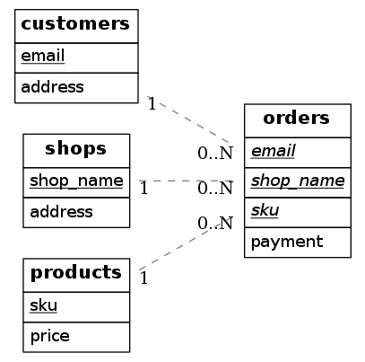

# 『リレーショナルデータベース入門［新訂版］−データモデル・SQL・管理システム−』読書メモ

## 第1章 データベースとは何か

### 演習問題 解答

#### 問題1

##### 概念モデル

- 実世界のデータ構造とその制約をアクセプタ（設計者やなんらかの機械）が解釈して、ある記号系（ER図など）で記述したもの

##### 論理モデル

- なんらかのDBMSで取り扱い可能な表現
- つまり、概念モデルをより具体的な実際にシステムとして動かすものに近づけたモデル

#### 問題2

##### ネットワークモデル

- レコード間の関係がポインタでつながった網の目構造をなしている

##### ハイアラキカルモデル

- 一対多関係が親子レコード階層として表され、ポインタでつながっている

##### リレーショナルモデル

- ポインタのような具体的なデータ間の関係を使用せず、フォーマルなリレーション（表）だけでデータモデルを表現する

##### オブジェクト指向

- オブジェクトのコンポジションをデータモデルとして表現している

#### 問題3

店舗 (`shops`)、顧客 (`customer`)、商品 (`products`)、注文 (`orders`) を例として考える。

##### （問1）

3項関連型を用いた実体−関連図。`*` 付きの属性が主キーである。

```
                                  (payment)
                                    |
(*email, address)-[customers] -L- <orders> -M- [products]-(*sku, price)
                                    |
                                    N
                                    |
                                  [shops]-(*shop_name, address)
```

##### （問2）

- 実体型はそのままリレーションへ変換する
- 関連型は多対多のとき関連する実体の主キーと関連型の属性を合わせたリレーションへ変換する

##### （問3）



##### （問4）

次の理由から第6正規形になっている。

- 部分関数従属がない
- 推移関数従属がない
- 非キーから主キーの部分集合への従属がない
- 主キーだけからなるリレーションがない

#### 問題4

##### ID関連型をリレーショナルデータベーススキーマへ変換する方法

- 弱実体型にID関連型の主キーを持たせ、主キーから部分キーを除いたものを所有実体型への外部キーとする

##### ISA関連をリレーショナルデータベーススキーマへ変換する方法

- いくつか方法がある
  - 親の実体の属性を子の実体に持たせてリレーションに変換し、親の実体はリレーションに変換しない
  - それぞれの実体をリレーションに変換する

#### 問題5

##### ファイル管理

- ファイルはレコードの集合であり、プログラム中で利用されることを前提としている。そこに統一的な管理は存在しないので、データの一貫性欠如や重複が起きうる

##### データベース管理

- DBMSで統一的にデータを管理するものであり、一貫性／アクセス権限／機密保護の保証が可能な、組織体における共通資源である

#### 問題6

店舗の運営で生じるデータ（原価、売上、データの生成日時など）を例として考える。

**データ**は仕入や販売を通じて生まれた数値の羅列である。そこから、どの時間にいくら利益が生じているかを見出すことで、どの時間にどの商品が売れやすい、という知識を増やすことができる**情報**を得られる。
