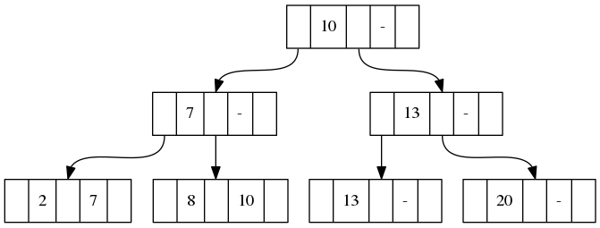
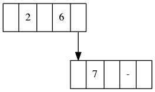
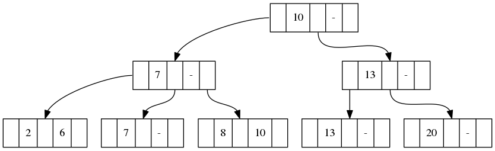
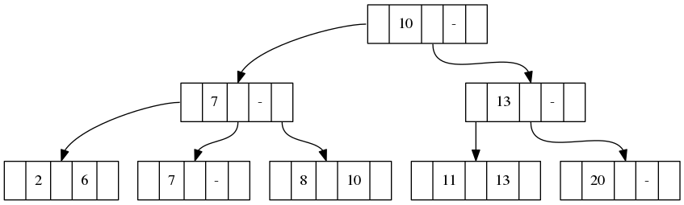
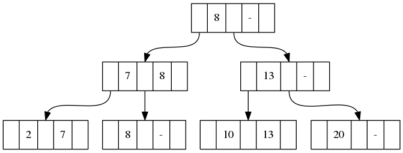
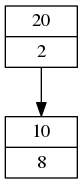
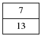

<script type="text/javascript" async src="https://cdnjs.cloudflare.com/ajax/libs/mathjax/2.7.1/MathJax.js?config=TeX-MML-AM_CHTML"></script>

# 『リレーショナルデータベース入門［新訂版］−データモデル・SQL・管理システム−』読書メモ

## 第1章 データベースとは何か

### 演習問題 解答

#### 問題1

##### 概念モデル

- 実世界のデータ構造とその制約をアクセプタ（設計者やなんらかの機械）が解釈して、ある記号系（ER図など）で記述したもの

##### 論理モデル

- なんらかのDBMSで取り扱い可能な表現
- つまり、概念モデルをより具体的な実際にシステムとして動かすものに近づけたモデル

#### 問題2

##### ネットワークモデル

- レコード間の関係がポインタでつながった網の目構造をなしている

##### ハイアラキカルモデル

- 一対多関係が親子レコード階層として表され、ポインタでつながっている

##### リレーショナルモデル

- ポインタのような具体的なデータ間の関係を使用せず、フォーマルなリレーション（表）だけでデータモデルを表現する

##### オブジェクト指向

- オブジェクトのコンポジションをデータモデルとして表現している

#### 問題3

店舗 (`shops`)、顧客 (`customer`)、商品 (`products`)、注文 (`orders`) を例として考える。

##### （問1）

3項関連型を用いた実体−関連図。`*` 付きの属性が主キーである。

```
                                  (payment)
                                    |
(*email, address)-[customers] -L- <orders> -M- [products]-(*sku, price)
                                    |
                                    N
                                    |
                                  [shops]-(*shop_name, address)
```

##### （問2）

- 実体型はそのままリレーションへ変換する
- 関連型は多対多のとき関連する実体の主キーと関連型の属性を合わせたリレーションへ変換する

##### （問3）


##### （問4）

次の理由から第6正規形になっている。

- 部分関数従属がない
- 推移関数従属がない
- 非キーから主キーの部分集合への従属がない
- 主キーだけからなるリレーションがない

#### 問題4

##### ID関連型をリレーショナルデータベーススキーマへ変換する方法

- 弱実体型にID関連型の主キーを持たせ、主キーから部分キーを除いたものを所有実体型への外部キーとする

##### ISA関連をリレーショナルデータベーススキーマへ変換する方法

- いくつか方法がある
  - 親の実体の属性を子の実体に持たせてリレーションに変換し、親の実体はリレーションに変換しない
  - それぞれの実体をリレーションに変換する

#### 問題5

##### ファイル管理

- ファイルはレコードの集合であり、プログラム中で利用されることを前提としている。そこに統一的な管理は存在しないので、データの一貫性欠如や重複が起きうる

##### データベース管理

- DBMSで統一的にデータを管理するものであり、一貫性／アクセス権限／機密保護の保証が可能な、組織体における共通資源である

#### 問題6

店舗の運営で生じるデータ（原価、売上、データの生成日時など）を例として考える。

**データ**は仕入や販売を通じて生まれた数値の羅列である。そこから、どの時間にいくら利益が生じているかを見出すことで、どの時間にどの商品が売れやすい、という知識を増やすことができる**情報**を得られる。

## 第2章 リレーショナルデータモデル

### 演習問題 解答

#### 問題1

候補キーはタップルを一意に識別できる属性の極小な組であり、あるリレーションに少なくとも1個以上存在する。一方、主キーは候補キーの中からもっとも意味があると設計者が考えて選んだキーであり、キー制約（一意性制約、非NULL制約）を課す。

キー制約はある主キーの値集合が必ず存在し（非NULL制約）、一意に識別できること（一意性制約）を保証する制約。外部キー制約はあるリレーションのある属性と同じ値の属性を持つタップルが別リレーションの主キーに必ず存在することを保証する制約。

#### 問題2

まず、リレーションとは「ドメインの直積の部分集合」であることから、各タップルは必ず異なる属性値の組となる。このとき、全属性のうち一部からなる組が候補キーにならない場合でも、全属性からなる組は必ずそのタップルを一意に特定できる候補キーとなるので、リレーションスキーマに候補キーが存在しないことはない。

#### 問題3

「配送」を表す次のリレーションスキーマは全属性の組が候補キー、すなわち主キーとなる：

```
配送 (配送業者, 配送先, 受取人名, 日時, 商品)
```

理由はほぼ自明だが、配送先だけでは複数人がその配送先に居住している可能性があるので、受取人名もキーとする必要がある点に注意。

#### 問題4

空集合への `SUM`, `AVG` の適用時に現れるNULLは値が0であることを意味している。

#### 問題5

第1章演習問題3(問3)の解答から少し変えている。

```
CREATE SCHEMA 店舗販売;
CREATE DOMAIN SKU型 NCHAR(10);
CREATE TABLE 店舗 (
  店舗名 NCHAR VARYING (50) NOT NULL,
  住所 NCHAR VARYING (100) NOT NULL,
  PRIMARY KEY (店舗名)
)
CREATE TABLE 商品 (
  SKU SKU型 NOT NULL,
  値段 INTEGER NOT NULL,
  在庫 INTEGER NOT NULL,
  PRIMARY KEY (SKU)
)
CREATE TABLE 顧客 (
  メールアドレス NCHAR(256) NOT NULL,
  住所 NCHAR(256) NOT NULL,
  PRIMARY KEY (メールアドレス)
)
CREATE TABLE 注文 (
  店舗名 NCHAR VARYING (50) NOT NULL,
  SKU SKU型 NOT NULL,
  メールアドレス NCHAR(256) NOT NULL,
  決済方法 NCHAR(50) NOT NULL,
  総額 INTEGER NOT NULL,
  購入日時 DATETIME NOT NULL,
  PRIMARY KEY (店舗名, SKU, メールアドレス, 購入日時),
  FOREIGN KEY (店舗名) REFERENCES 店舗(店舗名),
  FOREIGN KEY (SKU) REFERENCES 商品(SKU),
  FOREIGN KEY (メールアドレス) REFERENCES 顧客(メールアドレス)
)
```

#### 問題6

##### (問1)

問題5のスキーマにおいて、次の一貫性制約は検査制約によって定義できる。

- `商品` の `総額` は0以上の金額を表す
- `注文` の `決済方法` は定められた方法だけを持つ

SQL-92を使った定義を次に示す。

```
CREATE TABLE 商品 (
  SKU SKU型 NOT NULL,
  値段 INTEGER NOT NULL,
  在庫 INTEGER NOT NULL,
  PRIMARY KEY (SKU),
  CHECK (値段 ≧ 0);
);
CREATE TABLE 注文 (
  // ...
  決済方法 NCHAR(50) NOT NULL,
  // ...
  CHECK (決済方法 IN ('クレジットカード', '銀行振込', '代金引換'));
);
```

##### (問2)

問題5のスキーマにおいて、`注文` の `総額` が注文した個々の商品の金額の総和に一致している、という一貫性制約は表明によって定義できる。

##### (問3)

`注文` にタップルが挿入されたときに対応する `商品` のタップルの `在庫` が減少する、という一貫性制約はトリガによって定義できる。SQL-92を使った定義を次に示す。

```
CREATE TRIGGER 在庫引当
  AFTER INSERT ON 注文
    UPDATE 商品
      SET 在庫 = 在庫 - 1
      WHERE 商品.SKU = 注文.SKU;
```

#### 問題7

- あるリレーションに対する操作（挿入、更新、削除、選択、参照）やあるスキーマに対する操作（テーブル作成、ビュー作成、更新、削除、SELECT発行）をリレーション、ビューさらにはある列を対象にして権限を管理できる
- 権限の付与は連鎖できる。`WITH OPTION` を `GRANT` 文の末尾につけることで、権限が与えられたユーザは別のユーザにその権限を移譲できる。権限の剥奪も `ON CASCADE` で連鎖する

## 第3章 データ操作言語とリレーショナル代数

### 演習問題 解答

#### 問題1

リレーショナル代数表現とリレーショナル論理表現の両方で表すことを指示されているが、面倒なのでリレーショナル代数表現のほうだけ書く。

以降では

$$
\begin{align}
R &= \text{学生}[\text{大学名} = \text{"お茶大"}] \\
S &= (\text{学生} \times \text{アルバイト}) \times \text{会社}
\end{align}
$$

とする。

##### (問1)

$$
R[\text{学生名}, \; \text{住所}]
$$

##### (問2)

$$
(R[\text{住所} = \text{"池袋"}])[\text{学生名}]
$$

##### (問3)

$$
(R_{1}[R_{1}.住所 = R_{2}.住所]R_{2})[R_{1}.\text{学生名}, \; R_{2}.\text{学生名}]
$$

##### (問4)

$$
((R \times \text{アルバイト}) \times \text{会社})[\text{会社}.\text{会社名}, \; \text{会社}.\text{所在地}]
$$

##### (問5)

$$
(((R \times \text{アルバイト}) \times \text{会社}) \div R)[\text{会社}.\text{会社名}, \; \text{会社}.\text{所在地}]
$$

##### (問6)

$$
R[R.\text{学生名}] - (R \times \text{アルバイト})[R.\text{学生名}]
$$

##### (問7)

$$
(S[\text{会社名} = \text{"目白商事"}])[\text{学生}.\text{学生名}, \; \text{学生}.\text{大学名}]
$$

##### (問8)

$$
S_{1}[S_{1}.\text{住所} = S_{2}\text{所在地}]S_{2}
$$

##### (問9)

$$
R[\text{学生}.\text{住所} \ne R.\text{所在地}]R
$$

##### (問10)

$$
(S[\text{所在地} = \text{"大塚"}])[\text{給与} \ge 50]
$$

#### 問題2

##### (問1)

$$
(\text{製品}[\text{単価} \ge 100])[\text{製品番号}, \; \text{製品名}]
$$

##### (問2)

ステレオを生産している工場を表すリレーションを \\(R = (((\text{製品} \times \text{工場})[\text{製品}.\text{製品名} = \text{"ステレオ"}])\\) とすると

$$
(R[\text{工場}.\text{生産量} \ge 10])[\text{工場}.\text{工場番号}, \; \text{工場}.\text{所在地}]
$$

##### (問3)

\\(S = (\text{製品} \times \text{工場}) \times \text{在庫}\\) とすると

$$
((S[\text{工場}.\text{所在地} = \text{"札幌"}])[\text{在庫}.\text{在庫量} = 5])[\text{製品}.\text{製品名}, \; \text{工場}.\text{工場番号}]
$$

#### 問題3

##### (問1)

ある属性の値が不明であったり、適切な値が存在しない場合に、そのことを表すための値が必要だから。

##### (問2)

あるリレーションを \\(R = (A_{1}, A_{2}, ..., A_{n})\\) とするとき、Rの属性 \\(A_{i}\\), \\(A_{j}\\) 上の **\\(\theta\\)-選択** \\(R[A_{i} \theta A_{j}]\\) は次のリレーションである。

$$
R[A_{i} \theta A_{j}] = \{ t | t \in R \wedge t[A_{i}] \; \theta \; t[A_{j}] \}
$$

\\(A_{i} \theta A_{j}\\) は \\(A_{i}\\) と \\(A_{j}\\) が \\(\theta\\) という関係にあることを表し、このリレーションはその条件に当てはまるタップルだけをリレーション \\(R\\) から抽出したものとなっている。

ここで、リレーションの属性値が空値をとるとき、条件 \\(A_{i} \theta A_{j}\\) の真偽が定まらなくなる。この場合、その条件の値を不定とする3値論理を導入することで、空値を含むリレーションに対して**推量 \\(\theta\\)-選択**を上述した \\(\theta\\)-選択（こちらを真正 \\(\theta\\)-選択と呼ぶ）とは別に導入できるようになる。推量 \\(\theta\\)-選択は次のリレーションである。

$$
R[A_{i} \theta_{\omega} A_{j}] = \{ t | t \in R \wedge t[A_{i}] \; \theta \; t[A_{j}] \text{ IS UNKNOWN} \}
$$

ある条件の値が不定の場合、\\( \text{UNKNOWN}\\) であると見なされる。

## 第7章 ファイルのアクセス法と編成法

### 演習問題 解答

問題1, 2, 5は略

#### 問題3

図7.13(f)のB+木にレコード \\((6, \text{渡辺})\\) と \\((11, \text{小林})\\) を挿入するときの変化の過程を説明する。初期状態のB+木は次のとおり。



葉ノードにつながるレコードは省略している。

\\((6, \text{渡辺})\\) は左端葉ノードに入るべきレコードである。このノードは空きがないので、ノードを次の形に分割する。



元の葉ノードの最大値を親ノードに入れる。ここでは \\(6\\) である。



これで \\((6, \text{渡辺})\\) の挿入が完了した。次に \\((11, \text{小林})\\) を挿入する。これは右から二番目の葉ノードに入るべきレコードであり、ノードに空きがあるのでそのまま入れる。



#### 問題4

次のような形のB+木となり、逆順にレコードを挿入することでB+木の構造は変わる。木の構造が変わる理由としては、分割処理は前半の \\( \lceil p/2 \rceil \\) 個（\\(p\\) はB+木のオーダー）を元の葉ノードとするので、同じレコード群でも挿入順によって元の葉ノードに残るレコードが変わることが挙げられる。



#### 問題6

ハッシュ関数 \\(h(k) = k \bmod 2\\) でレコードを格納すると次のようになる。

- \\(B_0\\)



- \\(B_0\\)



社員レコード取得時のブロックの平均探索回数は次のとおり。

$$
(1 + 1 + 1 + 1 + 2 + 2) / 6 = 4 / 3 \approx 1.3
$$
